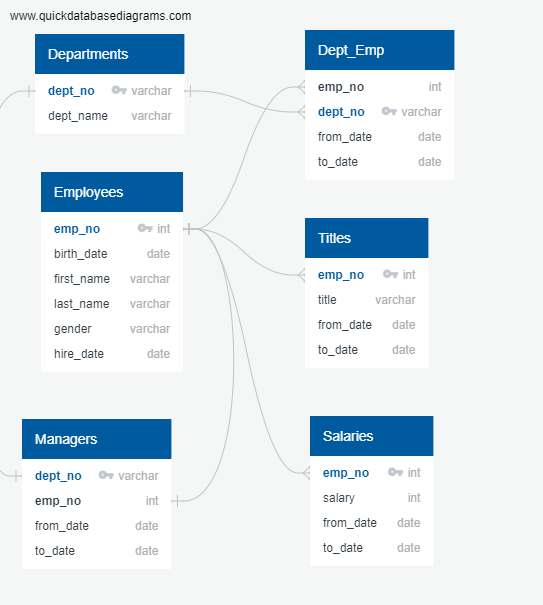

# Pewlett_Hackard 

## Summary
Assisted Bobby, an HR Analyst at Pewlett-Hackard, to determine the num ber of employees retiring, the number being hired, and the number available for a mentorship role. Our analysis concludes that 
          * 36,519 individuals should be retiring soon
          * 1,514 employees were hired for the year 1999, the most recent full year when employees were hired
          * 2,846 employees are ready for a mentorship role
          
In addition, to determining the total amount of employees retiring and the employees that are ready for mentorship position, further analysis and comparisons between departments can be done to find out which department should be focused on when pursuing hiring and mentoring efforts. 

## ERD

